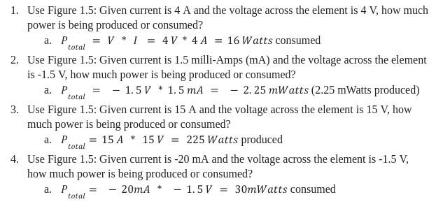
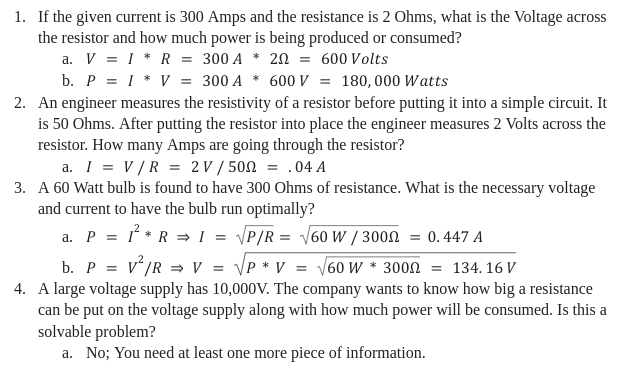
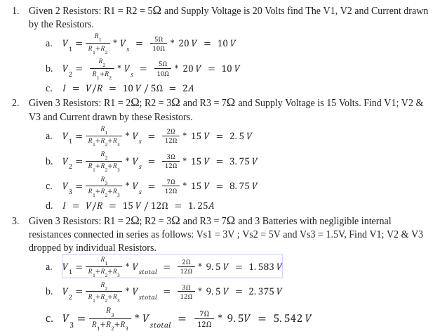
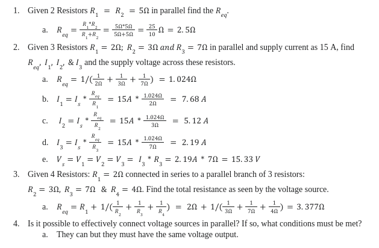
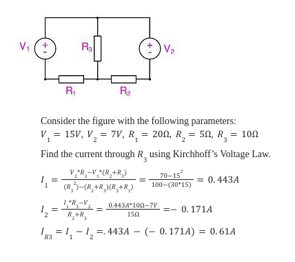

# 4401: Intro to Computational Neural Engineering: Course Answer Key

## Lesson One: How is our fear circuit hard-wired to learn fear?

## Lesson Two: The Sciences of Learning and Teaching

## Lesson Three: Basics of Electrical Circuits & Brain Circuits
### Electrical Circuit Analysis
#### Part 1 Solutions

#### Part 2 Solutions
  

#### Part 3 Solutions
 

#### Part 4 Solutions
  

#### Part 5 Solutions
  

### Circuits (Khan Academy) Exercises
1. (From video 1, Intro to Circuits & Ohm's Law) If V = 16 V and R = 8&#8486;, what is the current?  
&nbsp;&nbsp;&nbsp;&nbsp;&nbsp;&nbsp;Solution: I = V/R = 16V / 8&#8486; = 2 A 
2. (From video 2, Resistors in Series) Find the current for resistors in parallel if R1 = 2&#8486;, R2 = 3&#8486;, R3 = 5&#8486;, and V = 20 V.  
&nbsp;&nbsp;&nbsp;&nbsp;&nbsp;&nbsp;Solution: I = V/R = 20V/10&#8486; = 2 A
3. (From video 3, Resistors in Parallel) Given a circuit with two resistors in parallel with R1<\sub> = 20&#8486;, R2<\sub> = 5&#8486;, and V = 16 V, find the total resistance and use it to find the current.  
&nbsp;&nbsp;&nbsp;&nbsp;&nbsp;&nbsp; Solution: Req = 1/($\Large\frac{1}{20 Ohms}$ + $\Large\frac{1}{5 Ohms}$)  
&nbsp;&nbsp;&nbsp;&nbsp;&nbsp;&nbsp;I = V/Req = 16V / 4&#8486; = 4 A  
&nbsp;&nbsp;&nbsp;&nbsp;&nbsp;&nbsp;I1 = V/R1 = 16V/4&#8486; = 0.8 A  
&nbsp;&nbsp;&nbsp;&nbsp;&nbsp;&nbsp;I2 = V/R2 = 16V/20&#8486; = 3.2 A

### Capacitors & Capacitance Video Exercises
1. Given a 9 Volt battery that fully charges a capacitor with 3 Farads capacitance, what is the charge?  
&nbsp;&nbsp;&nbsp;&nbsp;&nbsp;&nbsp; Solution: C = Q/V => Q = CV = 3F \* 9V = 27 Coulombs
2. Given a 2 Farad capacitor that stores a charge of 6, what is the voltage?  
&nbsp;&nbsp;&nbsp;&nbsp;&nbsp;&nbsp; Solution: C = Q/V => V = Q/C = 6C/2F = 3 Volts

## Lesson Four: Basics of Electrical Circuits & Brain Circuits CONTINUED
## Lesson Five: The Neuron's Electrical Components
## Lesson Six: Measuring Membrane Potential
## Lesson Seven: The Power Source of a Neuron
## Lesson Eight: Modeling the Neuron as an Electrical Device
## Lesson Nine: From neurons to networks, what is a synapse?
## Lesson Ten: Models to Understand Neuronal Networks
## Lesson Eleven: What is fear?
## Lesson Twelve: How do we model tone and shock?
## Lesson Thirteen: How do we model synapses and plasticity?
## Lesson Fourteen: Constructing a 10-cell Amygdala Network
## Lesson Fifteen: Using a Model to Illustrate how the Amygdala Learns Fear